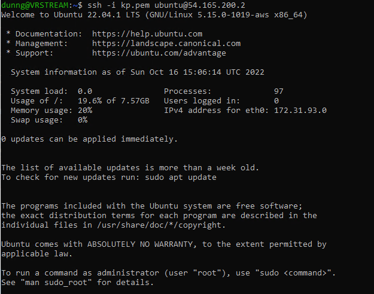

The way these AWS Vocereum lab environments are setup is a curse in a lot of ways.

1. Although you can continue a lab session indefinately by clicking the `:arrow_forward: Start Lab` button again to reset the time to `1:30`. You must remember to do this. I suggest setting a timer for an hour and 15 minutes or something so you are not right up against the time and clicking the button, repeat.

2. It won't (or at least I have not figured out how) to make a `user` in any of these labs so that you can make a programmatic access key that you can then use for any sort of automation of the actual AWS infrastructure like you can do with tools like: `awscli`, `Cloud Formation`, `Terraform`, etc. (Heck even `Ansible`)

I thought originally that the cloud automation tools like `Terrafom` and `Cloud Formation`. would be a good place to try and take this course. We could still do that depending on how this Ansible stuff goes but you guys would have to put your credit card on the line.  I would try and tell you how to do everything on the free tier and not get charged. It would be up to you though ultimately to manage that cost as I would have no control. 

I would rather not go down that path with your guys so instead I thought I would show you a tool that is widely used and can probably help you no matter where you end up (I hope). 

This ephemeral environment we have with Voceruem is great because there is no way to get charged. It will just stop working when you hit $150 I think for each lab which is impossible to do with what I will be showing you becuase it tears everything down automatically when you stop working. 

It is bad because you have to repeat the steps by clicking in the console to create resources everytime you launch the labs. I am going to show you a way to be able to quickly build and test things for your projects. You will still have to re-create the resources and generate a new `ssh` key each time but hopefully that should take just a minute or two and then as long as you keep clicking that `:arrow_forward: Start Lab` button before the `1:30` is up you can keep working for as long as you need. 

I think this is actually a blessing as it forces you to repeat the steps enough to really drive them home and also forces you to do the automation so that you can `save` your work. Don't worry if that seems fuzzy it will make more sense.

## A little perspective

Humans are not the best at doing tasks perfectly. Even the most graceful among use  spill drinks, burn our hands, etc from time to time. This is not limited to the physical realm. Even the brightest and most sharp among us from time to time make digital flubs. Even with the tasks we have done so far in this course it is easy to get confused to what you are doing switching back and forth between the console and the directions. Even if you use split screen. I am not claiming to be the brightest or sharpest but know I have had to go back a redo at least two of the labs because I missed something and I have been doing this a for a fair minute.

The point I am trying to drive home is that clicking around in the AWS console (or even manually running commands at the command line ) is a tedious and error-prone process. I love us as a species but we are not the best automation machines. We have thoughts that wander and people that demand our attention and all these other things that can take our focus away from what we are doing or rather *supposed* to be doing in the present moment. Especially when you are dealing with critical infrastructure in the cloud one falso move could have disasterous consequences. I have found two tactics to fight this tendency. 
 
1. Automate as much as possible. Automate things that you do often first but automate things you don't do often just to practice automating. This both makes you more proficient at the skill and also allows your team mates to benefit as well by learning from what you have figured out even if you don't say a word to them.

2. When building automation tools always think of what can go wrong. You want to have confidence that your tools will at the very least not break anything if they fail. This only comes with practice and startign small. 

In `Ansible` point 2. is accomplished mainly through striving to make everything `idempotent`. All that means is that the tool *only* makes changes that need to be made and otherwise leaves things alone. This also means you can run it multiple times and if everything is done it will make no changes. IE no chance of screwing anything up.


## [Ansible](https://docs.ansible.com/)

It is the automation tool [`Ansible`](https://docs.ansible.com/). [`Ansible`](https://docs.ansible.com/) is an open-source automation tool that is simple to use and very powerful. Although it is maintained by and has a paid-support product through `Red Hat` I want to stress that it is a free and open-source product at its core. 

The  name [`Ansible`](https://docs.ansible.com/) comes from Sci Fi. It is first said to have first been mentioned by [Ursula K. Le Guin](https://en.wikipedia.org/wiki/Ursula_K._Le_Guin) and then later used widely in the genre and has come to refer to a device capable of communicating instanteanously across great interstellar distances. So the idea is that you can do that same thing with all your servers. Whether those servers are virtual or physical. Or if they are single user workstations instead. Or  even the machine you are sitting in front of!

In fact [`Ansible`](https://docs.ansible.com/) has thousands of libraries to help with all kinds of automation tasks.

- https://docs.ansible.com/ansible/latest/collections/index.html
- https://galaxy.ansible.com/

You will find everything from Linux, Windows, MacOS, Cloud Services, a dizzying array of things. 

One the best features of [`Ansible`](https://docs.ansible.com/) is that it is agent-less. This means that you do not need to install any special software or run any special services running on any additional ports. You can do the automation over the same channels you already use for management. In our case here for this lab the communication channel is `SSH`.


Many servers in small IT shops are what is referred to as `Snowflake Servers`. This means literally that in order to replace that resource there would be multiple manual commands, etc that would be needed to get that resource back up or if you need to add capacity rapidly build new servers (or AMI images, docker containres, etc) to meet an increase in load demand.

[`Ansible`](https://docs.ansible.com/) does not require doing any python coding or have any special syntax outside of being [YAML](https://yaml.org/)-based. 


## Data file formats 

We have so far seen two different file formats that are widely used I want to call out specifically.

- [JSON](https://www.json.org)
- [YAML](https://yaml.org/)

If you continue in the cloud domain:  Both of these formats you will see come up again and again. They are not hard but both have a syntax and can be frustrating.

AWS historically tends towards `JSON` although in many cases these days I think you can use either with configuration chagnes if you have a strong preference.

Ansible makes extensive use of `YAML`. Here is a great introduction from the [ansible docs](https://docs.ansible.com/ansible/latest/reference_appendices/YAMLSyntax.html) 

Okay, let's catch our breath. We are starting to get ahead of ourselves.

First we need to see how to connect to our EC2 instances using `SSH`

## AWS

Since AWS does not allow password authentication. Before we launch our instances we first need to create a key pair to use for access.


Let's start by launching our [EC2 lab](https://awsacademy.instructure.com/courses/4354/modules/items/686600) from before.


If you ever see anything like the above you only need to click logout close that tab and then relaunch the console from the `AWS :green_circle:` link. You do NOT need to restart the lab.


The first thing you want to do when you first start Vocereum is to create a `key pair` that you can use to access the instances. Unfortunately you will have to do this each time you start a new session. You can ease the pain of this by saving the `.pem` file to the same location and with the same name each time. (The old one will no longer be good for anything)

The are a couple of ways to get to this section. One is by clicking on the navigating to the `EC2` dashboard


Click on the `Key pairs` link and you will be taken here:


Then click on `Create key pair`.


You want to give it a name (I chose `kp`) and then select `ED25519` and `.pem` and click `Create key pair`.


Now you just need to create the instance.

- Choose a name
- Select the default `Ubuntu` AMI (22.04)
- Select the Key Pair you made 
- Create New security group that allows `SSH` traffic from anywhere

Click `Launch Instance`

Once the launch completes you will get a `Success` message.


Click on the `instance id` link and on the instance summary page click the link to copy the public IP to your clipboard.


## Connecting to the AWS instances via SSH.

Here we have options. If you have a preferred method then please use that. 

If you are on a Mac then I hope the commands you type will be the same as those using Windows. Please let me know if you have any issues.

I have a project on github that has a `install.bat` file you can use to install a lite, portable version of `cygwin` with `Ansible` already included.

[install.bat](https://raw.githubusercontent.com/eddiedunnteaching/cygwin-noadmin/main/install.bat)
[run_shell.bat](https://raw.githubusercontent.com/eddiedunnteaching/cygwin-noadmin/main/run_shell.bat)


- Right-Click and download these file to some directory on your computer.
- Launch `Command Prompt`
- Change into the directory that contains the two files you just downloaded
- run `install.bat`

This will download and install a cygwin installation inside of the direcotory you are currently located.

Now we just need to run `run_shell.bat`


A few things to notice:

1. If you want to work with files in your windows home directory you must know where to look.

```bash
cd /cygdrive/c/Users/<username>
```

This will take you to your windows home directory.

OK now... connecting to this instance with `SSH`

If you followed along so far this command should get you in

```bash
ssh -i <path to your kp.pem> ubuntu@<public IP of instance>
```

I will ask you if you want to save the key in your local keystore. Say yes.

[ssh add key](./images/ssh_add_key.png)




If you get an error message about permisions then use the following command on your `.pem` file.

```bash
chmod 600 kp.pem 
```

This will make only the `user owner` able to see the contents of the private key.


## Take a screen shot and submit. This is the SSH Assignment


## Ansible and Windows

There are multiple ways you can go about installing `Ansible` on your system. `Ansible` is written in `Python` and as such can be installed perhaps most easily via `pip`. If you want to go that route fine. What I have just shown you uses cygwin. You might have used something similar to `cygwin` called `MinGW` . If you have ever used the `git bash` shell that comes with `git`. This is very similar.

`Ansible`'s lowest unit of code is called a [`module`](https://docs.ansible.com/ansible/latest/user_guide/modules_intro.html). 

The simplest way to run `ansible` is via a method called [`ad-hoc`](https://docs.ansible.com/ansible/latest/user_guide/intro_adhoc.html). As the name implies this is a method that lets you run ansible modules in a one-off manner.

Before you connect to the EC2 instance via ansible we must first make sure that the `host` key has been saved in our `~/.ssh/known_hosts` file. We can do this via `ssh`. 

If you get an ansible error about `Host key verification failed.` that is what is going on.

Let's try out a simple ping to our EC2 instance.

```bash
ansible all --key-file=kp.pem -u ubuntu -i 44.203.84.162, -m ping
 ````


Let's break down the command:

- `all` means to imply all hosts in the inventory. In this case there is only one host in the inventory so it is really just one host.
- `key-file` is the path to our `.pem` file we downloaded when we made our key pair.
- `-u ubuntu` specifies that we want to connect to the instance as the user `ubuntu`. This is something that you would just have to know or read. It is an AWS ubuntu AMI thing.
- `-i 44.203.84.162,` Is the inventory we are working with. This is usually a YAML or even `ansible` `INI` format. **Please note that the trailing comma is required or it will not parse it as a list.**
- `-m ping` Last but certainly not least tells which module we are going to run. The ping module works much like the ping command in networking. It checks to see that the host is avaialable and you can connect and manage.

Ok great. Now we know how to manage to our instances with ansible! We are on our way!

Another thing we can do to simplify things is to put some of these options in a configuration file so we don't have to keep typing them. `Ansible` has an `ansible.cfg` file we can put in our project directory that serves this purpose. 

Here are the contents of `ansible.cfg`

```ini
[defaults]

private_key_file = kp.pem
remote_user = ubuntu
#inventory = inventory.yml

```

Now we can run our `ad-hoc` command with fewer options:

```bash
 ansible all -i 44.203.84.162, -m ping
 ```

 In a real scenario we would be running these commands on many servers at once specified by the keyword `all` in an inventory file referenced in  `ansible.cfg` as shown in the commented line above. We could then even further simplify our command incantation to something like.

```bash
 ansible all  -m ping
 ```


Let's do a real example with our server. Let's install an apache web server using the apt module.

```bash
ansible all -i 52.55.1.42, -m ansible.builtin.apt -a "name=apache2 state=present" --become
```

Notice:

1. We do not have to know anything about how to run the actual command(s) to install the software on the server. We only need to know the name of the package.
2. This command is `idempotent`. It will only install `apache2` if it is not already present.
3. We used a new option `--become` this tell `ansible` that we will need to elevate permissions (run `sudo`, ie need admin access) to run this command.


If all goes well you should now have a running web server with the default page. Note you will need to modify the security groups to allow web traffic like you do in the actual lab instructions.


You can also do things like copy files to remote systems. Again like in the actual lab instructions let's create a simple `Hello World` html file in our project directory.

`index.html`
```html
<html><h1>Hello World!</h1></html>
```

```bash
ansible all -i 52.55.1.42, -m ansible.builtin.copy -a "src=index.html dest=/var/www/html/index.html" --become
```

The above will replace the default apache page with our `Hello World`