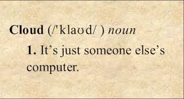
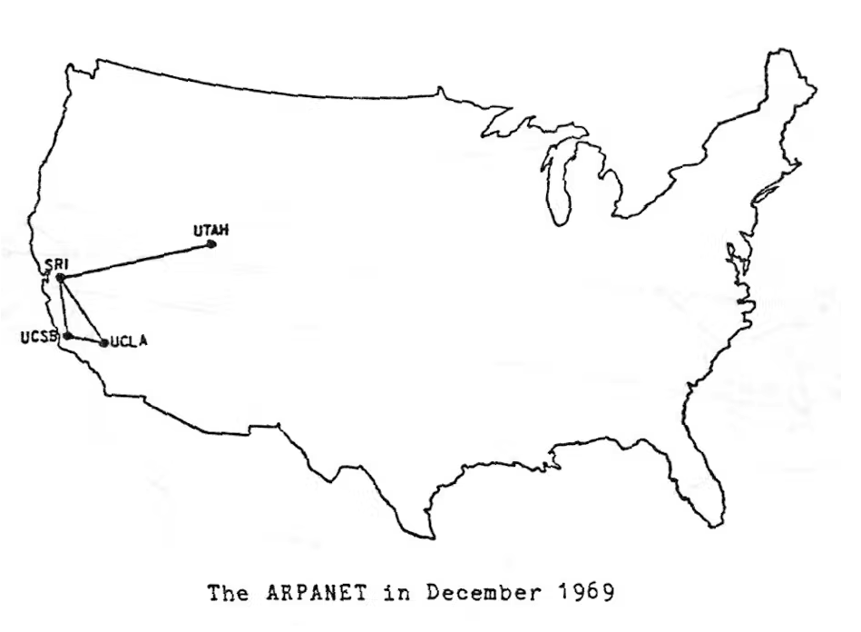
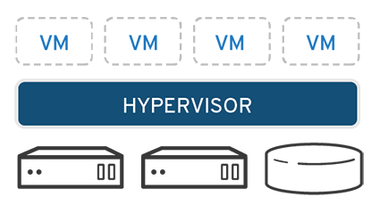

# CIT 301

However true and important to realize this tongue-in-cheek definition might be, It is a gross simplification as we will see over the course of the semester.

## History of Cloud Computing

The origins of cloud computing hearken back to the likes of [John McCarthy](https://en.wikipedia.org/wiki/John_McCarthy_(computer_scientist)) and his vision of [time-share computing](https://en.wikipedia.org/wiki/Time-sharing) being like a public utility that you could turn on and off.

## Technology and Business Innovations that enabled Cloud Computing

Many technology and businesss innovations have come together to make cloud computing the knock-out success it has become. The internet itself is not the least of these innovations.

### Internet was born

The internet got it's start through a US government research project called [ARPANET](https://theconversation.com/how-the-internet-was-born-the-arpanet-comes-to-life-68062). 

It started out in 1969 with only four computers but eventually grew to become what it is today. The modern internet!

- [How the Internet was born: from the ARPANET to the Internet - Giovanni Navarria](https://theconversation.com/au/topics/how-the-internet-was-born-32844)

---

## Virtualization

The next important enabling technology piece started evolving in the 60's as well and revolves around being able to make one big computer act like many small, isolated computers.

This is a different solution to the problem of allowing multiple users to access a single computer at once and is in contrast to the time-sharing model that Unix and later Linux had been so successful in implementing. Because of the early success of Unix it was a technically possible and mature long before it really took off. It is a great example of a technology that was pioneered long before it found a practical use.

In fact it was not until the 1990's when the convergence of two phenomena allowed the space to flourish.

1. Virtualization allows you to emulate old, legacy hardware, and software inside of of portable container that could be run on any variety of the much cheaper commodity servers om the market. In addition you could run more than one of these legacy systems on a single physical device. Saving many times over in hardware ependitures.

2. Allows for greater organizational agilty because you could easily spin up new servers to try out new ideas or to accomodate spikes in demand for resources and spin them down just as easily. This allows for greater utilization as well as efficiency. This also made modern software development preocesses and methodolgies such as agile possible.

These new possibilities made capacity and resource planning much easier than before. No longer did you have tight coupling of  hardware resources to  specific software stacks. You could have many and potentially very different versions of various Operating Systems, applications, etc all isolated and running on the same physical server.

We said that virtual machines (VM's) split up the compute, memory, and storage resources of a computer into isolated units.

It does this by running software on the actual server hardware that is able to imitate (emulate) all of the various hardware resources that an operating system needs to run but in software only and in an isolated manner so that one VM cannot see anything that is going on with another VM.

The virtual machines themselves think they are just a normal computer running on normal hardware.

The program that runs on the physical hardware that does all of this is called the `hypervisor`.

Virtualization Resources:

- [What is virtualization?](https://www.redhat.com/en/topics/virtualization/what-is-virtualization)

---

## World Wide Web

The next big thing to come along that contributed to the success of cloud computing is the World Wide Web. It goes without saying how important the web is to the internet and modern society in general. You are even mostly likely viewing this document through a web server/ web browser and `HTTP`.

Tim Berners-Lee is credited with inventing the web in 1989 while at CERN.

- [Short history of the web](https://home.cern/science/computing/birth-web/short-history-web)
- [First Web Address](http://info.cern.ch/) 

---

- [Brief History of Cloud Computing -  Keith D. Foote ](https://www.dataversity.net/brief-history-cloud-computing/#)
- [Brief History of Cloud Computing - Maximilliano Destefani Neto](https://www.ibm.com/blogs/cloud-computing/2016/08/23/a-brief-history-of-cloud-computing-2/) 

## What Advantages does cloud offer?

- *Business Advantages*: Cloud allows for an organization to shift from making IT resources a capital expenditure that might require months or even years of planning to making an operational expenditure that you pay for on an on-going basis. [CapEx vs OpEx in Cloud Computing](https://www.geeksforgeeks.org/capex-vs-opex-in-cloud-computing/)

- On demand

## AWS 

While there are many other cloud vendors we will primarily focus on AWS because they literally invented the space as we know it.

## 